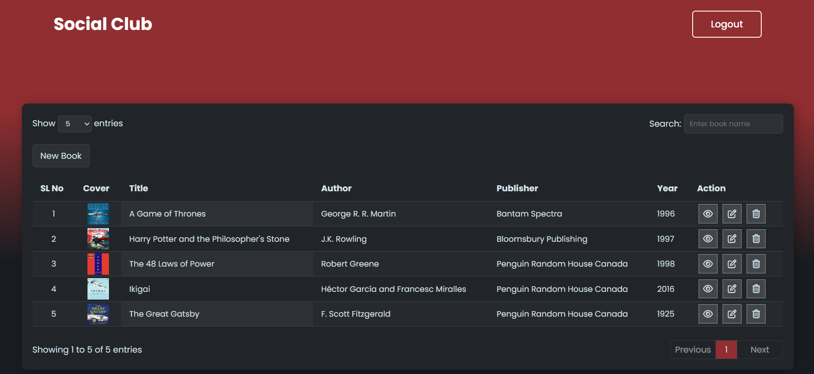

# 📚 Serverless Bookstore Application on AWS

A modern, fully serverless bookstore application demonstrating cloud-native architecture and Infrastructure as Code (IaC) practices. Built entirely on AWS using Terraform for infrastructure provisioning, this project showcases production-ready serverless patterns and best practices.

## 📸 Screenshots

### Landing Page

*Beautiful landing page featuring three prominent book covers (The Great Gatsby, Ikigai, The 48 Laws of Power) displayed on a dark red to black gradient background. Clean navigation with "Social Club" branding and login button.*

### Book Management Dashboard

*Complete CRUD interface showing a data table with book entries including cover images, titles, authors, publishers, and years. Features include search functionality, pagination controls (showing 5 entries per page), and action buttons (view, edit, delete) for each book. Dark-themed interface matching the landing page design.*

## 🎯 Project Overview

This application is a complete serverless bookstore management system that allows users to browse, add, update, and delete books. The entire infrastructure is provisioned using Terraform, making it easily deployable and maintainable. The application demonstrates modern cloud architecture patterns including serverless computing, NoSQL databases, API Gateway integration, and static website hosting.

## ✨ Key Features

- **🔐 User Authentication**: Secure user authentication using AWS Cognito
- **⚡ Serverless Backend**: RESTful API built with AWS Lambda (Python 3.8)
- **📊 NoSQL Database**: Scalable data storage with Amazon DynamoDB (on-demand billing)
- **🌐 API Gateway**: RESTful API endpoints with Lambda Proxy Integration
- **🎨 Modern Frontend**: Responsive web interface built with HTML, CSS, and JavaScript
- **☁️ Static Hosting**: Frontend hosted on Amazon S3 with public website configuration
- **🔧 Infrastructure as Code**: Complete infrastructure defined and managed with Terraform
- **🚀 CORS Enabled**: Cross-origin resource sharing configured for API access
- **📝 CRUD Operations**: Full Create, Read, Update, Delete functionality for book management

## 🏗️ Architecture

```
┌─────────────┐
│   Browser   │
│  (Frontend) │
└──────┬──────┘
       │
       │ HTTPS
       ▼
┌─────────────────┐      ┌──────────────┐
│   Amazon S3     │      │ API Gateway  │
│  (Static Site)  │      │  (REST API)  │
└─────────────────┘      └──────┬───────┘
                                 │
                                 │ Invokes
                                 ▼
                         ┌──────────────────┐
                         │   AWS Lambda     │
                         │  (Python 3.8)    │
                         └──────┬───────────┘
                                │
                                │ Reads/Writes
                                ▼
                         ┌──────────────────┐
                         │  Amazon DynamoDB │
                         │   (Books Table)  │
                         └──────────────────┘
```

## 🛠️ Tech Stack

| Component | Technology | Purpose |
|-----------|-----------|---------|
| **Infrastructure as Code** | Terraform | Infrastructure provisioning and management |
| **Frontend** | HTML5, CSS3, JavaScript (ES6+) | User interface and client-side logic |
| **Backend Runtime** | Python 3.8 | Serverless function execution |
| **API Layer** | AWS API Gateway (REST) | API endpoint management and routing |
| **Compute** | AWS Lambda | Serverless backend processing |
| **Database** | Amazon DynamoDB | NoSQL data storage (on-demand) |
| **Storage** | Amazon S3 | Static website hosting |
| **Authentication** | AWS Cognito | User authentication and authorization |
| **HTTP Client** | Axios | API communication from frontend |

## 📁 Project Structure

```
social-club/
├── app/                      # Frontend application
│   ├── index.html           # Landing page
│   ├── book_store.html      # Book management interface
│   ├── app.js               # Frontend JavaScript logic
│   ├── style.css            # Styling
│   └── images/              # Static assets
├── lambda/                   # Backend Lambda function
│   ├── lambda_functions.py  # Python Lambda handler
│   └── lambda_functions.zip # Deployment package
├── terraform/                # Infrastructure as Code
│   ├── main.tf              # Terraform provider configuration
│   ├── lambda.tf            # Lambda function and IAM roles
│   ├── api_gateway.tf       # API Gateway configuration
│   ├── dynamodb.tf          # DynamoDB table definition
│   └── s3.tf                # S3 bucket and static hosting
└── README.md                # Project documentation
```

## 🚀 Getting Started

### Prerequisites

- AWS Account with appropriate permissions
- Terraform >= 1.0 installed
- AWS CLI configured with credentials
- Python 3.8+ (for local Lambda development)

### Deployment Steps

1. **Clone the repository**
   ```bash
   git clone <repository-url>
   cd social-club
   ```

2. **Navigate to Terraform directory**
   ```bash
   cd terraform
   ```

3. **Initialize Terraform**
   ```bash
   terraform init
   ```

4. **Review the deployment plan**
   ```bash
   terraform plan
   ```

5. **Deploy the infrastructure**
   ```bash
   terraform apply
   ```

6. **Access the application**
   - Frontend URL will be displayed after deployment (S3 bucket website endpoint)
   - API Gateway endpoint will be shown in Terraform outputs

### Local Development

1. **Update Lambda code**
   ```bash
   # Make changes to lambda/lambda_functions.py
   cd lambda
   zip lambda_functions.zip lambda_functions.py
   ```

2. **Redeploy with Terraform**
   ```bash
   cd ../terraform
   terraform apply
   ```

## 🌐 API Documentation

### Base URL
```
https://<api-gateway-id>.execute-api.<region>.amazonaws.com/dev/books
```

### Endpoints

| Method | Endpoint | Description | Request Body | Response |
|--------|----------|-------------|--------------|----------|
| `GET` | `/books` | Retrieve all books | None | Array of book objects |
| `POST` | `/books` | Create a new book | JSON object with book details | Success message |
| `PUT` | `/books` | Update an existing book | JSON object with book details | Success message |
| `DELETE` | `/books` | Delete a book | JSON object with `id` field | Success message |

### Request/Response Examples

**Create Book (POST)**
```json
{
  "id": "1234567890",
  "title": "The Great Gatsby",
  "author": "F. Scott Fitzgerald",
  "publisher": "Scribner",
  "year": "1925",
  "cover": "https://example.com/cover.jpg"
}
```

**Response**
```json
{
  "message": "Book created successfully"
}
```

**Get All Books (GET)**
```json
[
  {
    "id": "1234567890",
    "title": "The Great Gatsby",
    "author": "F. Scott Fitzgerald",
    "publisher": "Scribner",
    "year": "1925",
    "cover": "https://example.com/cover.jpg"
  }
]
```

## 🔑 Key Technical Highlights

- **Serverless Architecture**: Zero server management with auto-scaling capabilities
- **Cost-Effective**: Pay-per-use pricing model (Free Tier eligible)
- **Infrastructure as Code**: Version-controlled infrastructure with Terraform
- **Scalability**: Automatic scaling based on demand
- **Security**: IAM roles with least privilege principle
- **CORS Configuration**: Properly configured for cross-origin requests
- **Error Handling**: Comprehensive error handling in Lambda functions
- **RESTful Design**: Standard REST API patterns and HTTP methods

## 🎓 Learning Outcomes

This project demonstrates:

- **AWS Services Integration**: Practical experience with multiple AWS services working together
- **Serverless Development**: Building and deploying serverless applications
- **Infrastructure as Code**: Managing cloud infrastructure with Terraform
- **API Design**: Creating RESTful APIs with proper error handling
- **Frontend-Backend Integration**: Connecting a frontend application to a backend API
- **NoSQL Database Design**: Working with DynamoDB and understanding NoSQL patterns

## 🔒 Security Features

- IAM roles with least privilege access
- DynamoDB table with proper access controls
- CORS headers configured for secure cross-origin requests
- API Gateway with Lambda Proxy Integration
- Environment variables for sensitive configuration

## 📈 Future Enhancements

- [ ] Add pagination for book listings
- [ ] Implement search functionality
- [ ] Add book categories and filtering
- [ ] Include book ratings and reviews
- [ ] Add user profile management
- [ ] Implement image upload functionality
- [ ] Add API rate limiting
- [ ] Integrate CloudWatch for monitoring and logging

## 📝 License

This project is open source and available for educational purposes.

## 👤 Author

Built as a demonstration of cloud-native serverless architecture and Infrastructure as Code practices.

## 🤝 Contributing

Contributions, issues, and feature requests are welcome! Feel free to check the issues page.

---

**Note**: This project is designed for learning and demonstration purposes. Make sure to configure appropriate security settings for production use.
